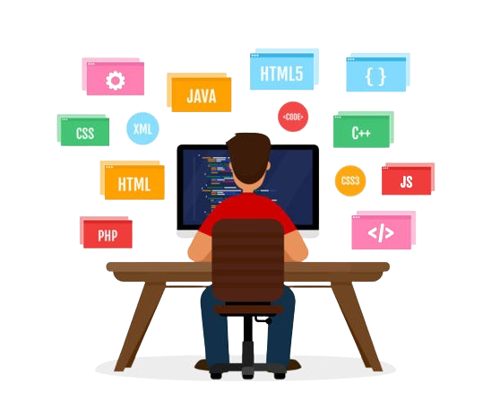

# Portfólio

## Apresentações
    
  - Olá eu sou Kevin ricardo, seja bem-vindo ao meu repositório, antes de tudo conheça algumas das minhas redes:

  
  
  

## Tecnologias
  
- Visite o repositório da linguagens python:

  
  
- Visite o repositório da linguagens C++:

  
  
- Visite o repositório da linguagens JavaScript:

  
